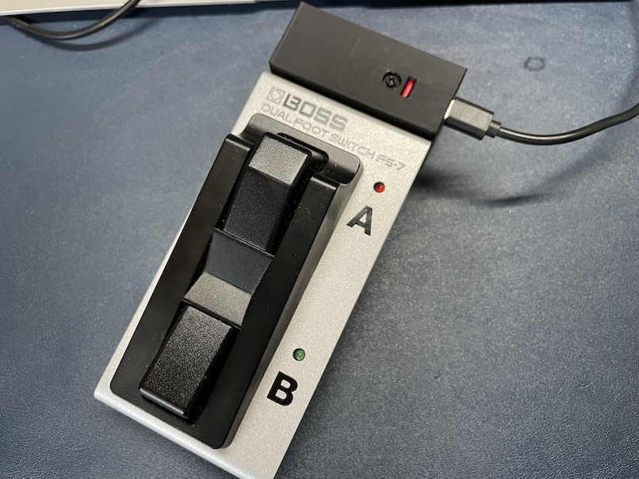
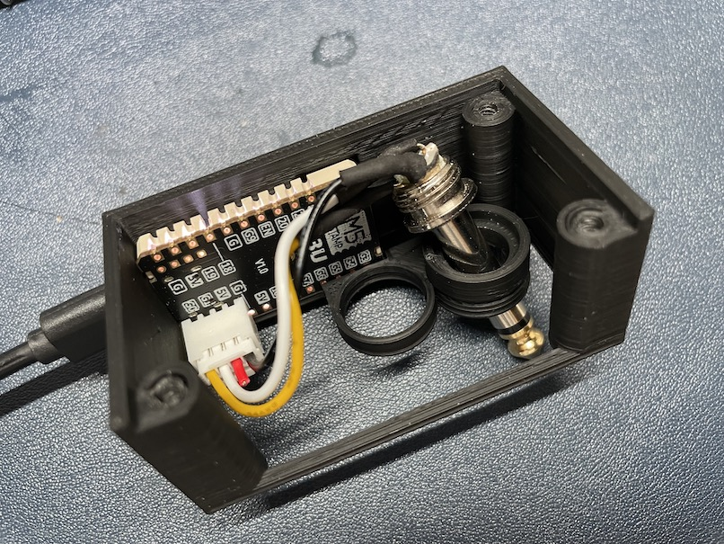
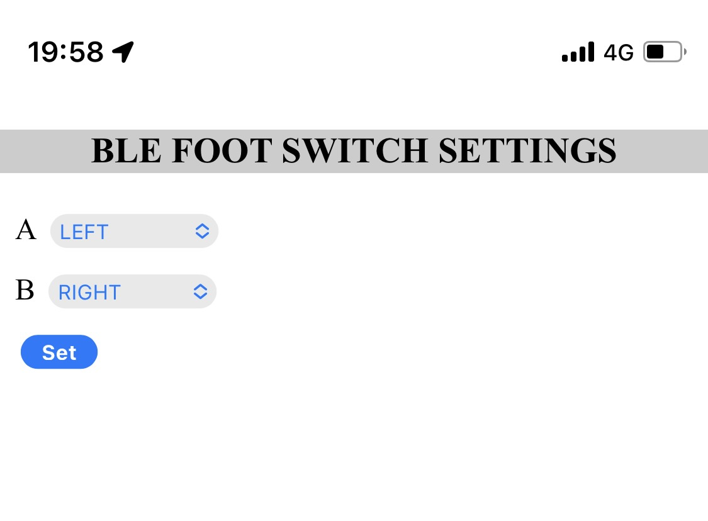

# BLE FootSwitch Adapter



### Upload firmware and resouce

Upload firmware.

```
pio run -e m5stampc3 -t upload
```

Upload resources.

```
pio run -e m5stampc3 -t uploadfs
```

env:```m5stack-atom``` is also available.


### Wiring

G0 <- Switch A
G1 <- Switch B
GND <- GND

##### Eample with BOSS FS-7

Use (A&B) phone jack (TRS).

G0 <- R
G1 <- T
GND <- S



### Pairing

1. Turn power on. (LED: red)
1. Find and connect M5FS in Bluetooth settings (LED: off)

Pressing switch A sends the LEFT-ARROW.  
Pressing switch B sends the RIGHT-ARROW.

### Setting

Hold switch A and B for 1 second to enter setting mode. (LED: white)

1. Connect to access point "M5FS" via Wi-Fi
1. Access to http://m5fs.local and select key-code.
1. Press switch A or switch B to reboot.



